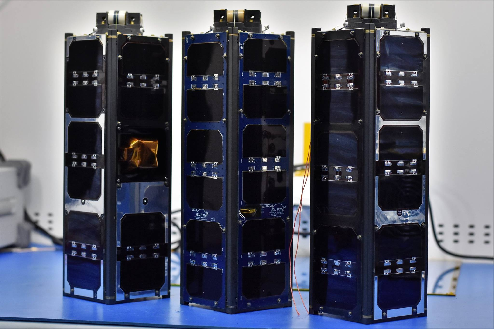
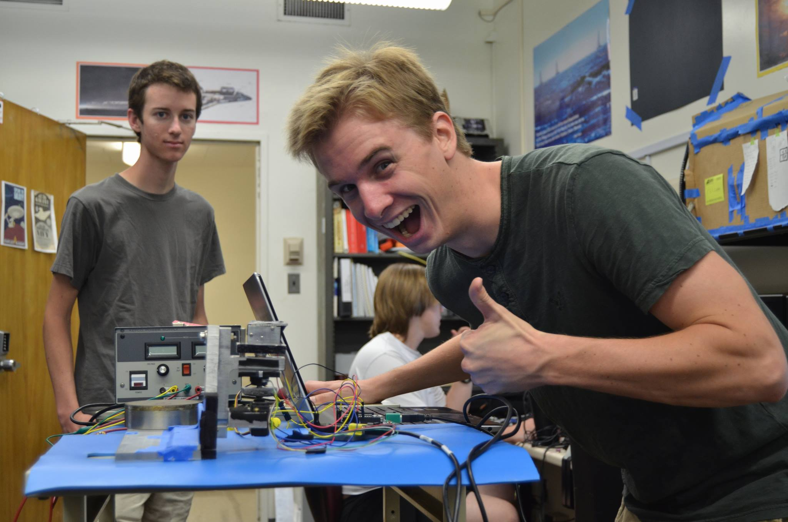

We're two days out from the launch of the ELFIN spacecraft, UCLA's first student-built satellites. At long last, September 15 is _the_ day!

I think ELFIN is a great mission and the program means a lot to me. But before I get into that, I want to unpack just what we've asked these tiny, anodized aluminum boxes to do.

## Space Weather

Earth weather is well understood. Today, we have thousands of buoys out at sea recording wave heights and wind speeds. This data helps forecasters build remarkably accurate predictive models.

Space weather is tricky and it's not as well modeled. We really don't have many buoys out in space collecting data. But if you were an astronaut out in space, wouldn't you want to know what your environment might look like tomorrow?

We live next to an active sun that ejects energetic particles toward Earth. As they reach our planet, those particles can become trapped in the Earth's radiation belts. They oscillate between the magnetic poles, jumping up and down along the field lines.

For reasons not yet understood, these trapped particles can sometimes be knocked out of their stable oscillations. They drop lower into the atmosphere, ionizing the surrounding gas and creating the auroras. In a nutshell, we don't really know the root cause behind all those pretty desktop backgrounds.

What we need is an investigation to study electron loss from the Earth's radiation belts. This is where ELFIN - the _Electron Losses and Fields Investigation_ - comes in.

## The Spacecraft

The ELFIN mission is composed of two identical CubeSats. Each contains a pair of particle detectors: one for electrons and another for ions. These instruments will measure particle counts and energy levels as the spacecraft pass over the poles. 

Each vehicle also has a high-precision magnetometer onboard. UCLA has been building magnetometers since the Apollo program, and this is the very first time they've been put on a Bruin satellite! The magnetometer acts as our localization system. We need to know where the particles are with respect to the magnetic field - no GPS required.

_Completed flight builds. Image by <a href="https://elfin.igpp.ucla.edu/">UCLA ELFIN Satellite</a>_

The rest of the spacecraft is dedicated to the satellite bus: batteries, radios, control systems, and flight computers. One major challenge was keeping the vehicle magnetically clean. We didn't want the magnetometer to pick up noise from the onboard systems.

ELFIN will be launched into a low-altitude, polar orbit. We want to fly directly through the regions where electron precipitation occurs. Not many space weather missions have taken measurements in these areas because the low altitude greatly reduces the mission lifetime. It's the perfect opportunity for a low cost CubeSat to provide high quality science data.

## The Impact

ELFIN played a huge role in my experience at UCLA. The mission also has some humble beginnings and it's amazing to see how far it's come.

I remember testing our first sun sensor in the new lab. We wanted to isolate the sensor from outside light sources, so I built this ridiculous enclosure of discarded keyboard boxes and blue tape. But hey, it worked and the resulting calibrations looked great.

_Testing the ELFIN fine sun sensor in the lab_

That initial work introduced me to attitude determination and control, which would open the door to an internship at Planetary Resources. ELFIN really set my career in motion and I'm thankful to have been a part of the mission.

Oh, and did I mention this is the *last* flight of the Delta II? Let's kick the tires and light the fires.

[themis-nasa]: https://www.nasa.gov/mission_pages/themis/mission/index.html