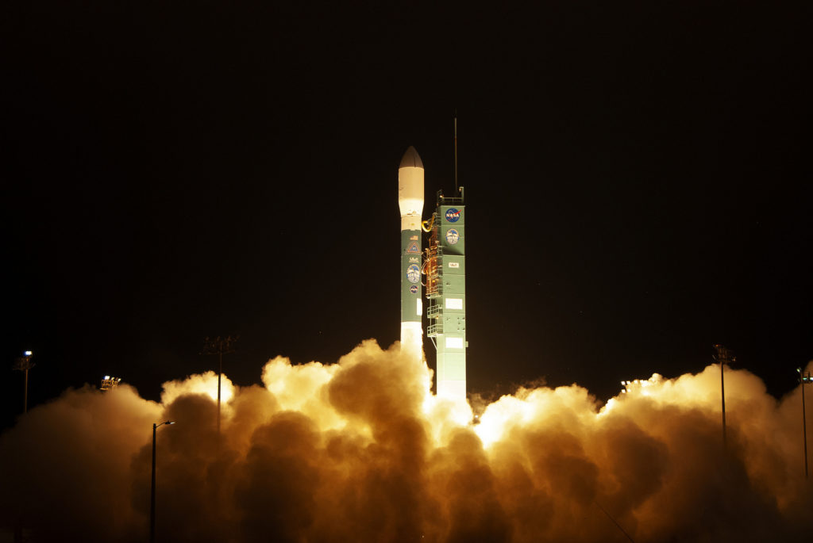

We have liftoff of the ELFIN spacecraft! Both satellites were carried into orbit this morning, ridesharing with the ICESat-2 mission onboard a Delta II rocket.

We arrived outside of Vandenberg Air Force base a bit after 4am. The Air Force shuttled us to an amazing viewing area with a direct line of the sight to the pad. The tracking cameras were positioned right in front of us and you could make out the blue hue of the Delta II.

The bleachers were packed with different missions and nearby speakers piped in audio from mission control. The crowd erupted when the launch director gave permission to launch, and then we watched quietly as terminal count started.

My eyes watered at T0 when the solid boosters ignited. The Delta II leapt from the pad and then, hilariously, immediately disappeared into the fog. But we sat in happy silence listening to the rocket rumble skyward.

A few hours later the ELFIN team received confirmation that both the A and B units were alive and beaconing. All in all, it was the perfect send-off for the Delta II and a new beginning for the ELFIN mission!

_Launch of ELFIN and the ICESat-2 mission. Image by <a href="https://blogs.nasa.gov/icesat2/">NASA/Kim Shiflett</a>_